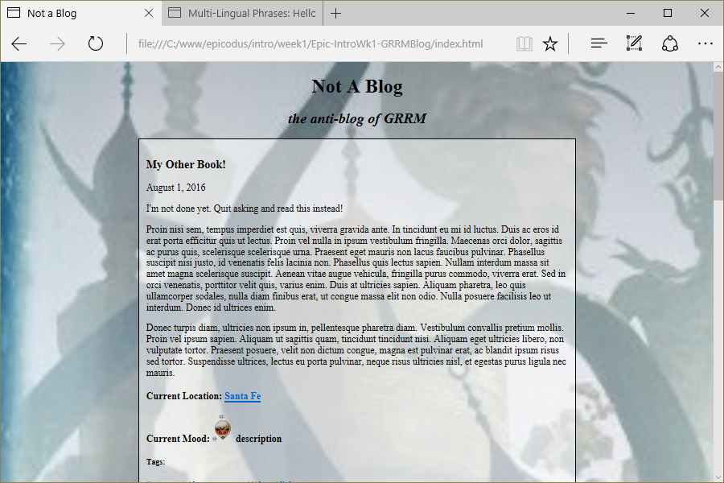

# GRRM Blog
Version 0.0.1: August 3, 2016
by [Karen Freeman-Smith](https://karenfreemansmith.github.io) and [Addison Nishijima](https://github.com/AddisonNishijima)

### Technologies Used
HTML, CSS, Git, Github

## Description
*[Epicodus](http://epicodus.com) Intro to Programming Week 1 Pair Project with Addison Nishijima: Design a blog layout to practice using CSS styles. Inspired by GRRM's 'Not a Blog'.*

## Setup/Installation
* [View on Github Pages](https://karenfreemansmith.github.io/Epic-IntroWk1-GRRMBlog)

__OR__
* Clone project to your computer
* Open index.html in your favorite browser

## Support & Contact
For questions, concerns, or suggestions please email karenfreemansmith@gmail.com

## Known Issues
* None

## Legal
* Licensed under the GNU General Public License v3.0

Copyright (c) 2016 Copyright _[Karen Freeman-Smith](https://karenfreemansmith.github.io) & [Addison Nishijima](https://github.com/AddisonNishijima)_ All Rights Reserved.
